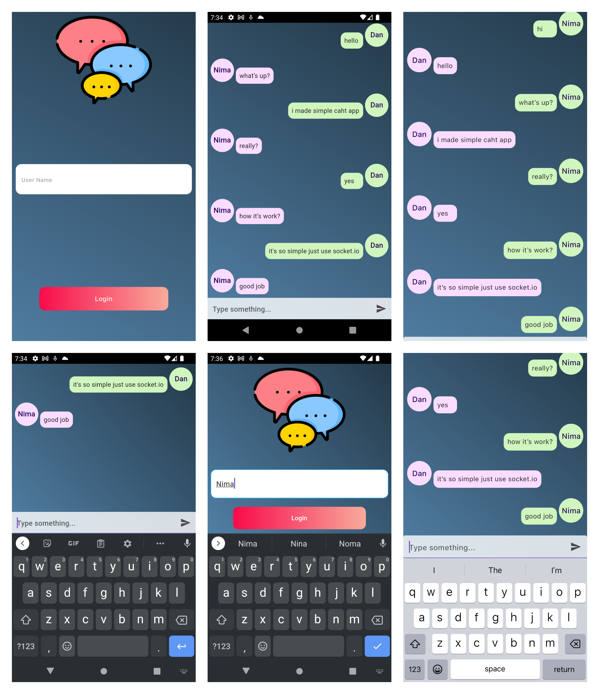

# simple chat app



Simple flutter chat application with socket.io 


**Run Server**

Run below command in root of project

```bash
node server/index.js
```

## Getting Started

Usage and development subject:
- socket.io-client-dart
- simple chat ui
- run simple node.js backend